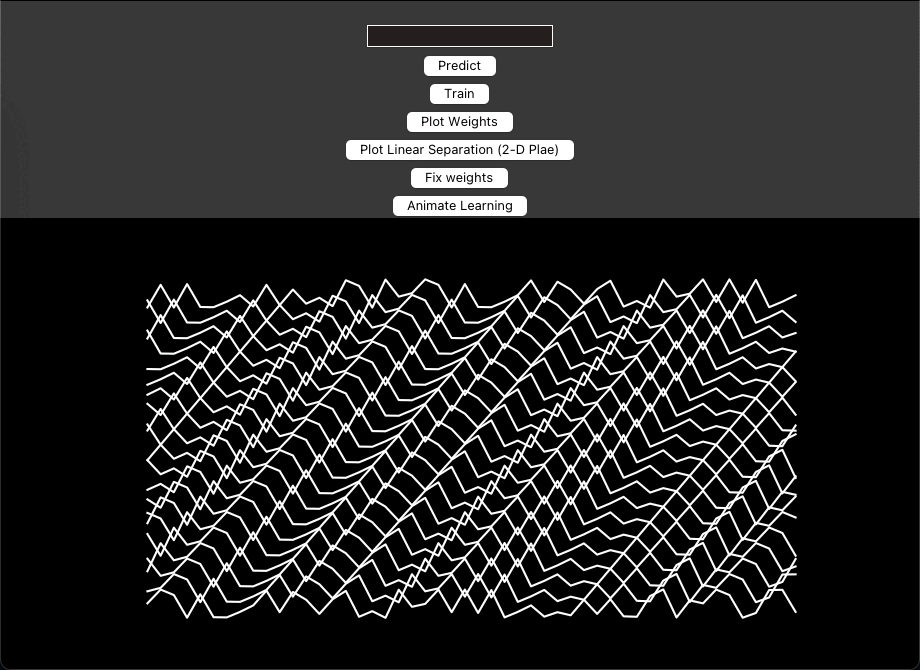
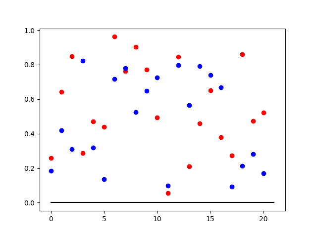
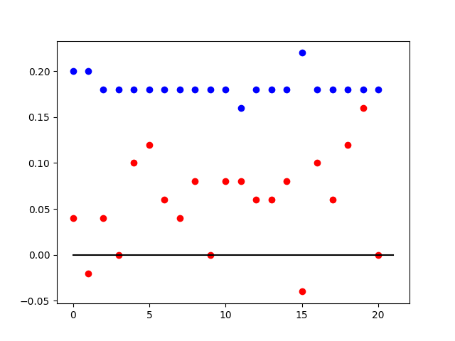

# 🧠 Perceptron Classifier for Binary Numbers

A simple neural network consisting of two single-layer perceptrons to classify 21-digit binary numbers into three categories based on the count of 'ones' present in the number. This project implements the fundamental concepts of perceptron-based classification, including weight initialization, prediction, training, and plotting decision boundaries.

<p align="center">
  <a href="./images/cover.png" target="_blank">
    
    </a>
</p>

---

<!-- @import "[TOC]" {cmd="toc" depthFrom=1 depthTo=6 orderedList=false} -->

<!-- code_chunk_output -->

- [🧠 Perceptron Classifier for Binary Numbers](#-perceptron-classifier-for-binary-numbers)
  - [📖 Overview](#-overview)
  - [🌟 Features](#-features)
  - [💻 Technologies Used](#-technologies-used)
  - [🛠 Installation and Setup](#-installation-and-setup)
  - [🚀 Usage](#-usage)
  - [💡 How It Works](#-how-it-works)
  - [👥 Contributing](#-contributing)
  - [📄 License](#-license)
  - [🎉 Acknowledgments](#-acknowledgments)

<!-- /code_chunk_output -->

---

## 📖 Overview

<p align="center" style="background-color: transparent;">
  
</p>

This project implements a simple neural network consisting of perceptrons to classify 21-digit binary numbers into three categories based on the count of 'ones' present in the number. The categories are:

1. Numbers with more than 15 ones. ✅
2. Numbers with less than 15 ones. ❌
3. All other numbers. 🔄

The implementation demonstrates the fundamental concepts of perceptron-based classification, including weight initialization, prediction, training, and plotting decision boundaries. This project is part of my software engineering portfolio, showcasing my understanding of machine learning algorithms and my ability to implement them from scratch.

---

## 🌟 Features

<p align="center">
  
</p>

- **Perceptron Training**: Trains two separate perceptrons to classify the binary numbers into the specified categories.
- **Prediction**: Predicts the category of a new 21-digit binary number.
- **Visualization**: Plots the decision boundaries of the perceptrons and the distribution of the binary numbers based on the classification.
- **Interactive GUI**: A simple Tkinter GUI for easy interaction with the perceptron classifier.

## 💻 Technologies Used

- Python 3
- NumPy for numerical operations
- Matplotlib for plotting
- Tkinter for the GUI
- Scikit-learn for PCA (Principal Component Analysis) used in plotting decision boundaries

## 🛠 Installation and Setup

Ensure you have Python 3.x installed on your system. You can download Python [here](https://www.python.org/downloads/).

Clone the repository to your local machine:

```bash
git clone https://github.com/Dor-sketch/PerceptualBinaryClassifier/git
```

Navigate to the cloned repository:

```bash
cd perceptron-binary-classifier
```

Install the required Python packages:

```bash
pip install numpy matplotlib scikit-learn
```

---

## 🚀 Usage

To run the program and launch the GUI, execute the following command in the terminal:

```bash
python perceptron.py
```

The GUI will open, allowing you to interact with the perceptron classifier.

<p align="center">
  
</p>

In the GUI, you can:

- Enter a 21-digit binary number to predict its category.

- Train the perceptron models with generated binary numbers.

- Plot the decision boundaries and the distribution of binary numbers.

- Visualize the weights of the perceptrons and the learning process via real-time animations.

<p align="center">
  
</p>

The project also includes commented code for genrating advanced visualizations and testing the perceptron models. For now, it is not recommended to run the code in the `perceptron.py` file, as it may take a long time to execute.

<p align="center">
  

  

  

  
</p>

## 💡 How It Works

Our task is classifying 21-digit binary numbers into 3 classes:

1. More than 15 ones
2. More than 15 zeros
3. Else

We can't use a single one-layer perceptron to solve the problem for the following reasons:

1. A perceptron can only classify linearly separable problems, and this problem is not linearly separable. The three classes are not linearly separable.

2. Even if the problem were linearly separable, the output of the perceptron is binary, and we need to classify the input into 3 classes.

With multiple single-layer perceptrons **we can** classify the 21-digit binary numbers into 3 classes in the following way:

The input to the perceptrons will be the 21-digit binary number represented as a vector of 21 elements. The output of perceptron i will be 1 if there are more than i 1s in the input, and 0 otherwise.

We'll set eta to 1 for simplicity.

We will use a number of perceptrons as follows:

1. The first perceptron will be trained to classify if the input has more than 15 1s. The weights of the perceptron will adjust during the training to find the hyperplane that separates the input into 2 classes. For example, a perceptron with the following weights will classify if the input has more than 0 1s: \(w_{0+} = [1, 1, 1, ..., 1]\). A perceptron with the following weights will classify if the input has more than 1 1s: \(w_{1+} = [0.5, 0.5, 0.5, ..., 0.5]\) And so on. Using the same method, we can construct the perceptrons that will classify if the input has more than 15 1s: \(w_{15+} = [\frac{1}{16}, \frac{1}{16}, \frac{1}{16}, ..., \frac{1}{16}]\)

2. We can deduce the second class by taking the output of the 1's finders: if the output of the 6th perceptron is -1, then the input doesn't have more than 6 1s, and thus, has more than 15 0s. The same applies for the 5th perceptron and so on until the first perceptron. Alternatively, we can use a similar method to the one used for the 1's finders, but for zeros. For example, a perceptron with the following weights will classify if the input has at least 1 0: \(w_{1-} = [\frac{1}{21}, \frac{1}{21}, \frac{1}{21}, ..., \frac{1}{21}]\). A perceptron with the following weights will classify if the input has at least 15 0s: \(w_{15-} = [\frac{1}{6}, \frac{1}{6}, \frac{1}{6}, ..., \frac{1}{6}]\) And so on. Note again that the threshold is 1, so if we sum the weights and the input and the result is less than 1, then the input has at least 1 0.

3. We can get the first class by taking the output of the first perceptrons, the second class by taking the output of the second perceptron - if it's -1, it means not even 6 ones, and hence -> more than 15 zeros. The third class is identified by taking the rest of the cases (the first is -1 and the second is 1).

| Before training | After training |
| --- | --- |
|  |  |

## 👥 Contributing

Contributions to this project are welcome! Please feel free to fork the repository, make your changes, and submit a pull request.

## 📄 License

This project is open-sourced under the MIT License. See the [LICENSE](./LICENSE) file for more information.

## 🎉 Acknowledgments

This problem is an implementation of a problem presented in the course "**CA 20581 Biological Computation**" 2024a, taken at *the Open University of Israel*.
